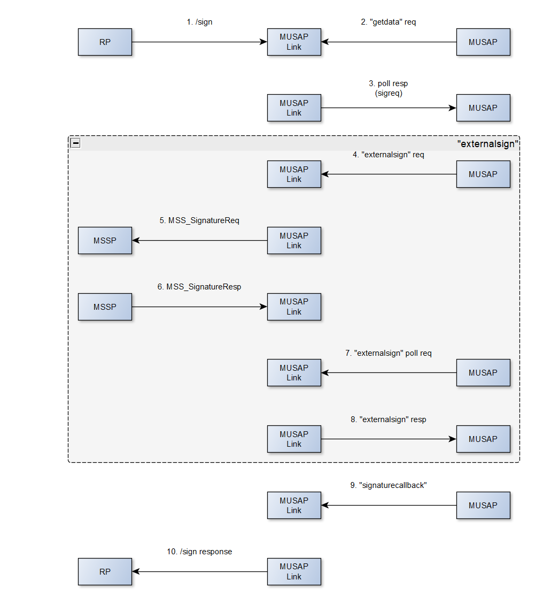
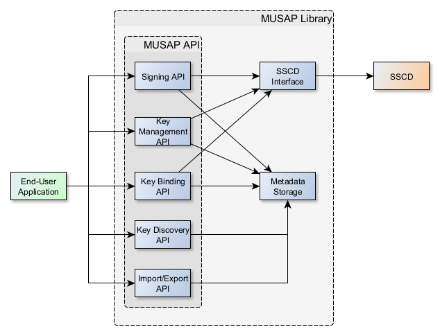

# MUSAP iOS Library

MUSAP (Multiple SSCDs with Unified Signature API) is an iOS library designed to simplify the integration of multiple Secure Signature Creation Devices (SSCD) with a unified signature API.
It provides a set of tools and utilities to streamline the implementation of secure signature creation mechanisms in iOS applications.

## Features
* **Multiple SSCD Integration**: MUSAP simplifies the integration of multiple Secure Signature Creation Devices into your iOS application.
* **Unified Signature API**: Utilize a unified API for signature operations, abstracting the complexities of individual SSCD implementations.
* **Secure Signature Creation**: Implement secure and standardized methods for creating digital signatures within your application.
* **Customizable**: MUSAP is designed with flexibility in mind, allowing developers to customize and extend its functionality according to specific project requirements.

### Reference implementation app

We have a reference implementation app available that serves as an example on how to use the library.
You can find the app project from https://github.com/methics/musap-demo-ios

## Installing

To integrate MUSAP into your iOS project, follow these steps:

1. Open your Xcode project.

2. Go to "File" > "Swift Packages" > "Add Package Dependency..."

3. Enter the URL for musap-ios, which is https://github.com/methics/musap-ios

4. Choose the version or branch you want to use.

5. Click "Next" and then "Finish."          

## Configuration

Depending on your setup, there might be some configuration required.
When using Yubikey SSCD, we need to conform to yubikit requirements. [See requirements from Yubikit github repository.](https://github.com/Yubico/yubikit-ios)


Example info.plist from reference implementation app below.

```xml
<?xml version="1.0" encoding="UTF-8"?>
<!DOCTYPE plist PUBLIC "-//Apple//DTD PLIST 1.0//EN" "http://www.apple.com/DTDs/PropertyList-1.0.dtd">
<plist version="1.0">
<dict>
	<key>CFBundleIdentifier</key>
	<string></string>
	<key>NSFaceIDUsageDescription</key>
	<string>App requires to use biometric authentication to access keys</string>
	<key>keychain-access-groups</key>
	<array>
		<string>$(AppIdentifierPrefix)fi.methics.MUSAP-demo-app-ios</string>
	</array>
	<key>NFCReaderUsageDescription</key>
	<string>The application needs access to NFC reading to communicate with your YubiKey.</string>
	<key>NSCameraUsageDescription</key>
	<string>The app is using camera for something</string>
	<key>UISupportedExternalAccessoryProtocols</key>
	<array>
		<string>com.yubico.ylp</string>
	</array>
	<key>com.apple.developer.nfc.readersession.iso7816.select-identifiers</key>
	<array>
		<string>A000000308</string>
		<string>A0000005272101</string>
		<string>A000000527471117</string>
		<string>A0000006472F0001</string>
	</array>
</dict>
</plist>

```

Example .entitlements file below.

```xml
<?xml version="1.0" encoding="UTF-8"?>
<!DOCTYPE plist PUBLIC "-//Apple//DTD PLIST 1.0//EN" "http://www.apple.com/DTDs/PropertyList-1.0.dtd">
<plist version="1.0">
<dict>
	<key>com.apple.developer.nfc.readersession.formats</key>
	<array>
		<string>TAG</string>
	</array>
	<key>keychain-access-groups</key>
	<array>
		<string>$(AppIdentifierPrefix)fi.methics.MUSAP-demo-app-ios</string>
	</array>
</dict>
</plist>

```

## Usage

### Enabling an SSCD

Before we can use an SSCD to create keys or signing, we must enable it.

Call `MusapClient.enableSscd()`

```swift
import SwiftUI
import musap_ios

@main
struct MyApp: App {

    init() {
        // Enable SSCDs. For example YubikeySscd
        MusapClient.enableSscd(sscd: YubikeySscd())
    }

    var body: some Scene {
        WindowGroup {
            NavigationTabView()
        }
    }
}

```

### Generating a key

Create a key generation request and call `MusapClient.generateKey()`. The key generation result is delivered asynchronously through the given callback.

```swift
let sscdImplementation = YubikeySscd()
let keyAlgo            = KeyAlgorithm(primitive: KeyAlgorithm.PRIMITIVE_EC, bits: 384)
let keyGenReq          = KeyGenReq(keyAlias: self.keyAlias, role: "personal", keyAlgorithm: keyAlgo)

Task {

await MusapClient.generateKey(sscd: sscdImplementation, req: keyGenReq) {
    result in


    switch result {
    case .success(let musapKey):
        print("Success! Keyname: \(String(describing: musapKey.getKeyAlias()))")
        print("Musap Key:        \(String(describing: musapKey.getPublicKey()?.getPEM()))")

        print("isEC? \(String(describing: musapKey.getAlgorithm()?.isEc()))")
        print("isRSA? \(String(describing: musapKey.getAlgorithm()?.isRsa()))")
        print("Bits: \(String(describing: musapKey.getAlgorithm()?.bits))")

    case .failure(let error):
        print("ERROR: \(error.errorCode)")
        print(error.localizedDescription)
        self.errorMessage = "Error creating musap key"
        self.isErrorPopupVisible = true
    }
}
}

```

### Signing

Select a key, create a signature request. Finally call `MusapClient.sign()`.


```swift
let algo = SignatureAlgorithm(algorithm: .ecdsaSignatureMessageX962SHA256)
let signatureFormat = SignatureFormat("RAW")

let sigReq = SignatureReq(key: musapKey, data: data, algorithm: algo, format: signatureFormat, displayText: "Display text", attributes: [SignatureAttribute(name: "someKey", value: "SomeValue")])


Task {
    await MusapClient.sign(req: sigReq) { result in

        switch result {
        case .success(let musapSignature):
            print("Success!")
            print(" B64 signature: \(musapSignature.getB64Signature()) ")
            base64Signature = musapSignature.getB64Signature()
        case .failure(let error):
            print("ERROR: \(error.localizedDescription)")
        }
    }

}
```

### Binding keys

Operation to bind an existing SSCD and keys with MUSAP.

```swift

let dtbd = "data to display"

guard let link = MusapClient.getMusapLink() else {
    print("NO link")
    return
}

let settings = ExternalSscdSettings(clientId: "1")
let sscd = ExternalSscd(settings: settings, clientid: "1", musapLink: link)

let keyBindReq = KeyBindReq(
    keyAlias: "keyForMusap",
    did: "did",
    role: "role",
    stepUpPolicy: StepUpPolicy(),
    attributes: [KeyAttribute](),
    generateNewKey: true,
    displayText: dtbd
)

Task {
    await MusapClient.bindKey(sscd: sscd, req: keyBindReq) { result in

        switch result {
        case .success(let musapKey):
            // success, got MusapKey
            print("musapKey: \(String(describing: musapKey.getKeyAlias()))")
        case .failure(let error):
            // Failure, handle it
            print("BindKeyView: error in bindkey: \(error)")
        }


    }
}
```

### Listing keys

```swift

let keys = MusapClient.listKeys()

for key in keys {
    // get your data
}

```

### Get key by KeyURI

```swift
guard let key = MusapClient.getKeyByUri(keyUri: "yourKeyUri") else {
    // Key not found
    return
}

```

### Exporting Data

Exports MUSAP key data and SSCD details as a JSON string.

```swift
guard let exportData = MusapClient.exportData() else {
    // got nil, cant export data
    return
}

// success, we can import the data to another MUSAP
```

### Import Data

Imports MUSAP key data and SSCD details from a JSON string.

```swift
let dataToImport = "..."
do {
    MusapClient.importData(data: dataToImport) // void return
} catch {
    // handle error
    print("error: \(error)")
}
```

### Remove specific MusapKey

```swift
let keyToRemove: MusapKey(...)
let keyWasRemoved = MusapClient.removeKey(musapKey: keyToRemove)

print("Key removal success: \(keyWasRemoved)")
```

### Get enabled SSCDs

Get list of SSCDs that have been enabled MusapClient.enableSscd().

```swift
guard let enabledSscds = MusapClient.listEnabledSscds() else {
    print("No enabled SSCDs")
    return
}

for sscd in enabledSscds {
    // Get SSCD name so we can display it in a list
    guard let sscdName = sscd.getSscdInfo().sscdName else {
        print("No name for sscd ")
        continue
    }
    print("SSCD: \(sscdName)")

    enabledSscdList.append(sscd.getSscdInfo())
}
```

### Get active SSCDs

Get a list of SSCDs that has keys active.

```swift
let activeSscds = MusapClient.listActiveSscds()

for sscd in activeSscds {
    // get something from sscd, like name to display in a list
    guard let sscdName = sscd.sscdName else {
        print("SSCD does not have a name set")
        continue
    }

    activeSscdList.append(sscd)
}

```

## Usage: MUSAP Link

MUSAP has an optional server component called MUSAP Link Library. This server component is designed to provide the following functionalities:

* Remote SSCD integration
* MUSAP HTTP API
* Push Notifications

The link library does not store any critical user data.
It only stores push notification tokens and transport security keys for each registered MUSAP client library.
Registering a MUSAP library to the link library is always optional and a user choice.




## Get MUSAP ID

```swift
guard let musapId = MusapClient.getMusapId else {
    // handle case
    print("No musap ID found")
    return
}
```

## Get MUSAP Link

```swift
guard let musapLink = MusapClient.getMusapLink() else {
    // No musap link
    return
}

```

## Enable MUSAP Link

```swift
let musapUrl = "https://someurl.com"
let musapId = MusapClient.getMusapId()
let externalSettings = ExternalSscdSettings(clientId: "the_client_id")

if musapId == nil {
    if let link = await MusapClient.enableLink(url: musapUrl, apnsToken: "123abc") {
        // we have enabled link, enable sscd if you haven't already
        MusapClient.enableSscd(sscd: ExternalSscd(settings: externalSettings, clientid: "the_client_id", musapLink: link))
    }
}

```

## Disable MUSAP Link

```swift
MusapClient.disableLink()
```

## Coupling with Relying Party

In order to sign from relying partys website, you need to be coupled with it.

```swift
let theCode = "ABC123" // get the code from the RP

Task {
    await MusapClient.coupleWithRelyingParty(couplingCode: theCode) { result in
        DispatchQueue.main.async {
            switch result {
            case .success(let rp):
                print("Coupling OK: RP name: \(rp.getName())  linkid: \(rp.getLinkId())")
            case .failure(let error):
                // Handle error
                print("musap error: \(error)")
            }
        }
    }
}

```

## Polling MUSAP Link for signature requests

Poll MUSAP Link for an incoming signature request. This should be called periodically and/or
when a notification wakes up the application.

```swift
Task {
    await MusapClient.pollLink() { result in
        switch result {
        case .success(let payload):
            print("Successfully polled Link")
            self.payload = payload
            let mode = payload.getMode()

            // You might want to handle different flows somehow.
            switch mode {
            case "sign":
                print("Sign only")
                self.showSignView = true
            case "generate-sign":
                print("Generate and sign")
                self.showBindKeyView = true
            case "generate-only":
                print("Generate only")
                self.showBindKeyView = true
            default:
                break
            }

        case .failure(let error):
            print("Error in pollLink: \(error)")
        }

    }
}
```

## List Relying Parties

We can list enrolled relying parties with MusapClient.listRelyingParties().

```swift

guard let relyingParties = MusapClient.listRelyingParties() else {
    // Handle nil
    return
}

```

## Removing a Relying Party

```swift
let success = MusapClient.removeRelyingParty(relyingParty: rpToRemove)
if success {
    // RP removed!
}
```

## Signing with MUSAP Link

See [MusapClient.sign()](#signing).

## Sending Signature Callback

We need to send back the MusapSignature to Link.

```swift
let signature = MusapSignature(...)
let transId   = "abc123" // this we get from PollResponsePayload
MusapClient.sendSignatureCallback(signature: signature, txnId: transId) // void return
```

## Architecture

### MUSAP Library




### MUSAP Link


# Contributing to musap-ios

We welcome contributions to musap-ios! This document provides guidelines for contributing to the project.

## How to Contribute

1. *Fork the repository* - Start by forking the repository to your GitHub account.
2. *Clone your fork* - Clone your fork to your local machine for development.
3. *Create a new branch* - Create a branch in your local repository for your contribution.

## Submitting Changes

1. *Commit your changes* - Make your changes in your branch and commit them with a clear, descriptive message.
2. *Push to your fork* - Push your changes to your fork on GitHub.
3. *Create a Pull Request* - Submit a pull request from your fork to the main repository. Provide a clear description of your changes.

## Coding Guidelines

- Follow the existing coding style.
- Write tests for your changes.
- Ensure your code passes all tests.

## Reporting Issues

- Use the GitHub issue tracker to report bugs.
- Provide detailed information about the issue, including steps to reproduce it.

Thank you for contributing to musap-ios!

# Security Policy for musap-ios

## Reporting a Vulnerability

If you believe you have found a security vulnerability in musap-ios, please follow these steps:

1. **Do not report security vulnerabilities through public GitHub issues.**
2. **Email the maintainers** - Send an email to methics.info@methics.fi detailing the vulnerability. Include steps to reproduce, if possible.
3. **Wait for response** - Allow the maintainers time to respond and assess the vulnerability.

## Security Patch Process

- The maintainers will confirm the receipt of your report.
- A security advisory will be created on GitHub to track the issue.
- A fix will be developed and tested in a private repository.
- Once the fix is ready, it will be released in a new version of the software.

## Disclosure Policy

- We believe in responsible disclosure of vulnerabilities.
- We will coordinate with you to determine an appropriate disclosure date.

## Commitment to Security

- We are committed to ensuring the security and privacy of our users.
- Regular audits and updates are conducted to maintain the security of the project.

Your efforts to responsibly disclose your findings are greatly appreciated and will be acknowledged.


## License

This project is licensed under the Apache License 2.0 - see the [LICENSE](LICENSE) file for details.


